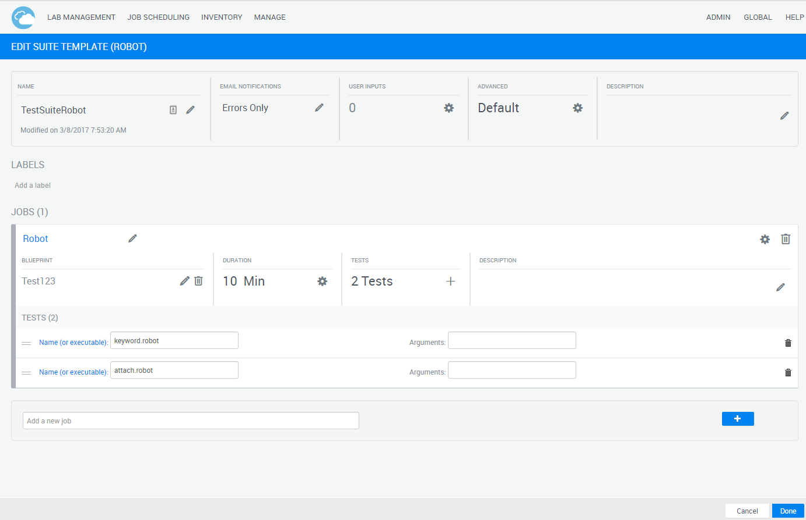

# BasicCloudShellRobot
This is a repository with a proof-of-concept easy implementation of calling Robot Tests (Python Robot Framework) from Quali CloudShell SnQ. [Sample screenshots in this pptx](Images/CloudShellRobot.pptx)

# Setup
* Deploy a linux VM (Ubuntu)
* In CloudShell, Add a new Custom Execution Server Type of `Robot` (Job Scheduler -> Edit Execution Server Types -> Add)
* On that VM, start the docker container based on the Dockerfile 
* Note that you may need to modify the config.json... I'm working on that
* Create a Blueprint with a single resource with the resource script HelloWorld.py attached. [A sample one is provided](CSScripts/RobotExampleBlueprint.zip)
* Create a job suite for Robot using the above blueprint. Valid tests should be as follows:

# Deploying docker container
## From source
* `docker build -t gskyqsrobot`
* `docker run -t -i -d -p 2222:22 --name qsrobot gskyqsrobot `

## From Dockerhub
* `docker run -t -i -d -p 2222:22 --name qsrobot graboskyc/qualicsrobot `

# Modifications
Note that the default config.json has the IP you need. You likely need to modify it:
* SSH to that ubuntu box
* `ssh -l qualisystems localhost -p 2222` and password is `Password1` or `docker ps` and identify container ID, then `docker exec -u 0 -it {cntrid} bash`
* You should be /opt/BasicCloudShellRobot
* `cd CES`
* `vi config.json` and change the IP address there and save 
* rerun the register routine: `python ces.py register`
* run the actual Custom Execution Server `python ces.py` and you probably want to nohup that... 

## Persistant Modifications
* Run `docker run -i -t -d --name qsrobot -v /root/qsrobot:/opt/BasicCloudShellRobot graboskyc/qualicsrobot`
* `docker ps` and find the running container for qsrobot and stop it using `docker stop {containerid}`
* Run `mkdir /root/qsrobot;cd /root/qsrobot; git clone https://github.com/graboskyc/BasicCloudShellRobot.git .`
* Modify the /root/qsrobot/CES/config.json
* Run `docker start {containerid}`